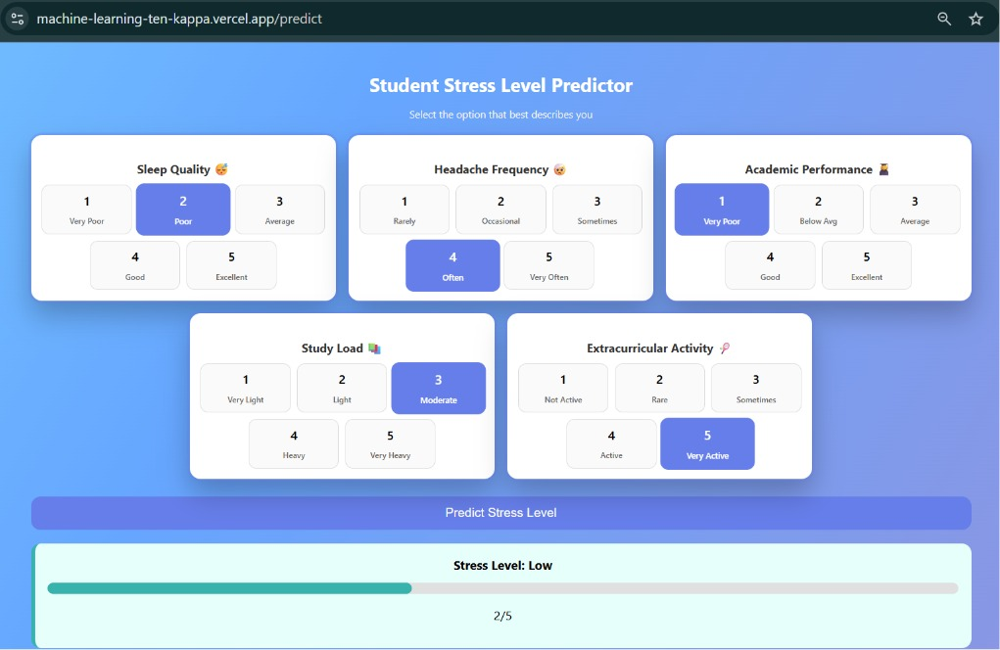

# 🎓 Student Stress Level Prediction

A Machine Learning-based web application that predicts the stress level of students based on various academic, lifestyle, and personal factors.

🔗 **Live Demo:** [machine-learning-ten-kappa.vercel.app](https://machine-learning-ten-kappa.vercel.app)

---

## 📸 Preview



> *Add a screenshot of your running app here. Save it as `assets/screenshot.png`.*

---

## 🚀 Project Overview

Student stress is a critical issue affecting academic performance and mental well-being. This project uses **Machine Learning algorithms** to analyze student input data and predict stress levels - helping in early identification and management.

---

## 🧠 Features

- 📊 Predicts student stress level across 5 levels (Very Low → Very High)
- 📁 Trained on a real-world student stress dataset
- ⚙️ StandardScaler preprocessing + ML classifier
- 🌐 Web-based interface built with Flask
- 📈 Simple input form for instant predictions
- 📦 Modular, clean project structure

---

## 🏗️ Project Structure

```
student-stress-level-prediction/
│
├── dataset/           # Dataset used for training
├── model/             # Saved ML models (.pkl files)
├── templates/         # HTML templates (UI)
├── training/          # Model training scripts / notebooks
├── assets/            # Screenshots and images for README
│
├── app.py             # Main Flask application
├── requirements.txt   # Python dependencies
├── .gitignore         # Files excluded from version control
├── LICENSE            # MIT License
└── README.md          # Project documentation
```

---

## ⚙️ Tech Stack

| Layer       | Technology                          |
|-------------|-------------------------------------|
| Language    | Python 3.x                          |
| ML Library  | Scikit-learn                        |
| Data        | Pandas, NumPy                       |
| Backend     | Flask                               |
| Frontend    | HTML, CSS                           |
| Deployment  | Vercel                              |

---

## 📊 Machine Learning Workflow

1. **Data Collection** - Student stress dataset with physiological & academic features
2. **Data Preprocessing** - Handling missing values, StandardScaler normalization
3. **Feature Selection** - 5 key input features identified
4. **Model Training** - Classifier trained and evaluated
5. **Model Evaluation** — Accuracy, F1-score measured
6. **Deployment** — Flask app deployed on Vercel

---

## 📈 Model Performance

| Metric        | Score  |
|---------------|--------|
| Accuracy      | *Add your accuracy here* |
| F1-Score      | *Add your F1-score here* |
| Algorithm     | *e.g. Random Forest / SVM / KNN* |

> See `training/` for the full training notebook and evaluation.

---

## 📌 Input Parameters

| Feature                   | Description                        | Range |
|---------------------------|------------------------------------|-------|
| Sleep Quality             | Quality of sleep                   | 1–5   |
| Headache Frequency        | How often headaches occur          | 1–5   |
| Academic Performance      | Self-rated academic performance    | 1–5   |
| Study Load                | Amount of study pressure           | 1–5   |
| Extracurricular Activity  | Involvement in activities          | 1–5   |

---

## 📈 Output

The model predicts one of five stress levels:

| Label         | Emoji |
|---------------|-------|
| Very Low      | 😌    |
| Low           | 🙂    |
| Moderate      | 😐    |
| High          | 😟    |
| Very High     | 😫    |

---

## 🖥️ How to Run the Project

### 1. Clone the Repository

```bash
git clone https://github.com/n-a-n-d-a-n/student-stress-level-prediction.git
cd student-stress-level-prediction
```

### 2. Install Dependencies

```bash
pip install -r requirements.txt
```

### 3. Run the Application

```bash
python app.py
```

### 4. Open in Browser

```
http://127.0.0.1:5000/
```

---

## 🌍 Deployment

Live on Vercel: [machine-learning-ten-kappa.vercel.app](https://machine-learning-ten-kappa.vercel.app)

---

## 💡 Future Enhancements

- [ ] Add Deep Learning models (LSTM, ANN)
- [ ] Improve UI/UX design with React frontend
- [ ] Real-time stress tracking dashboard
- [ ] Personalized stress-reduction recommendations
- [ ] Integration with wearable device APIs

---

## 🤝 Contributing

Contributions are welcome! Feel free to fork the repo and submit a pull request.

---

## 📜 License

This project is licensed under the [MIT License](LICENSE).

---

## 👨‍💻 Author

**Nandan (n-a-n-d-a-n)**  
AI & Data Science Student — VIT Pune  
🚀 Open Source Enthusiast
